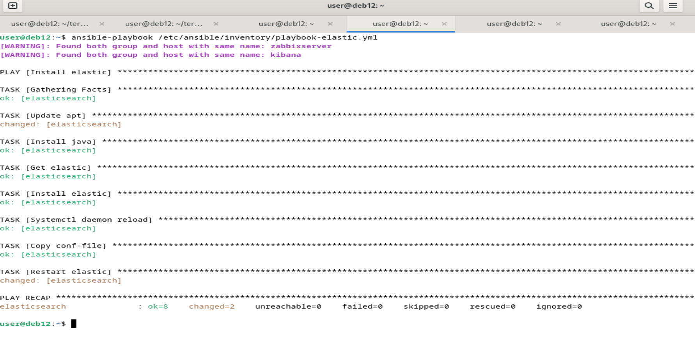
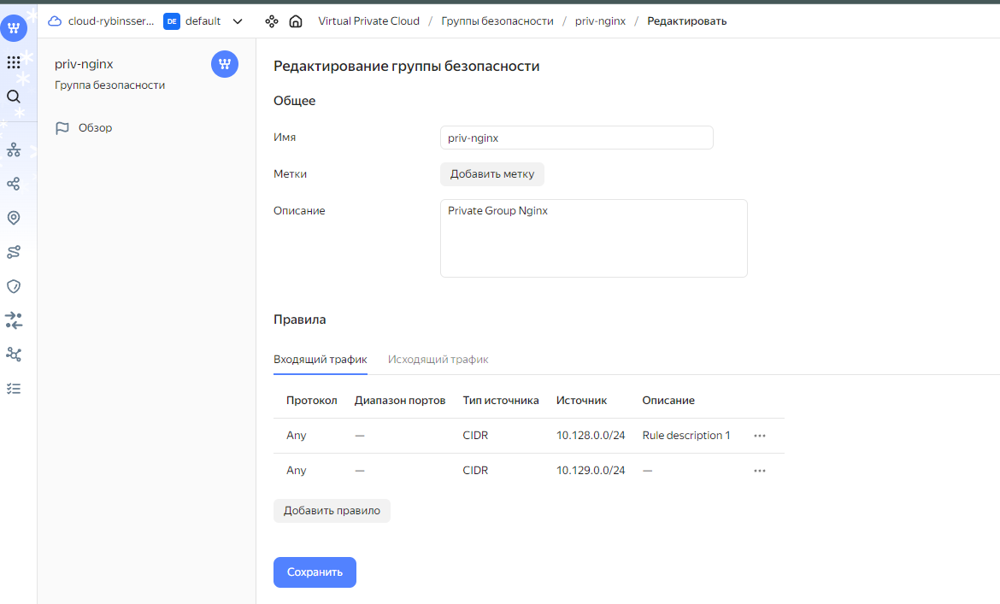

# Rybin_SS_diplom
Rybin_SS_diplom

# Решение

Все использованные при работе файлы находятся в этом же репозитории в директории `Files`.

1. Поднимаю ВМ, балансировщик, Группы безопасности и Роутер.

----
2. Установка nginx на соответствующие машины через ansible-playbook.

Делаю запрос к Балансировщику `curl -v <публичный IP балансера>:80`. Сайт доступен по адресу Балансировщика http://158.160.130.207/

----
3. Устанавливаю на эти же машины сразу Filebeat и Zabbix-agent.

----
4. Устанавливаю Zabbix-server.пришлось устанавливать по инструкции с сайта Zabbix, включая создание базы mysql. Zabbix-server доступен по внешнему адресу http://158.160.104.38/zabbix

----
5. Устанавливаю Elasticserch и проверяю запросом curl `localhost:9200/_cluster/health?pretty`.

----
6. Устанавливаю Kibana и проверяю http://158.160.122.98:5601/app/dev_tools#/console.

----

7. Создаю и поднимаю отдельно планировщик резервного копирования.

   

----
9. Редактирую группы безопасности для некоторых ВМ. Теперь к ВМ nginx и elasticserch можно подключиться только с Bastion.

*Bastion*

*Nginx*

*Балансировшик*

*Zabbix*

   

*Elasticsearch*

   

-----
